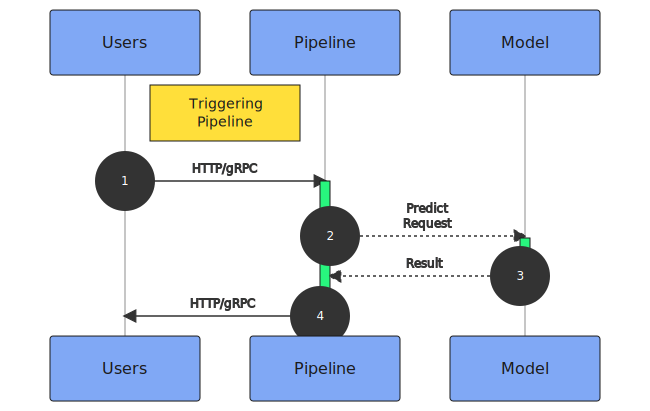
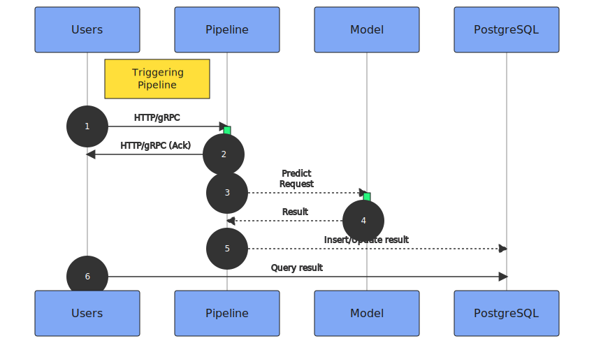

# Pipeline Mode

Depending on the requirements of your use case, you can create a pipeline with a suitable _Pipeline Mode_: synchronous (`SYNC`) and asynchronous (`ASYNC`).
The mode of a pipeline is determined by the combination of data source and data destination. We use the diagrams below to show the difference.

### SYNC
A pipeline with the `SYNC` mode responds to requests synchronously. The result is sent back to the user once the data is processed. This mode is a good fit for use cases with real-time inference requirements.

To create a pipeline with the `SYNC` mode, please use `Direct` for both data source and destination.

### ASYNC

A pipeline with the `ASYNC` mode responds to asynchronous workload. The user triggers the pipeline with an asynchronous request and only receives an acknowledged response. Once the data is processed, the result is sent to the data destination to be retrieved later. This mode is a good fit for use cases that do not need inference results immediately.

